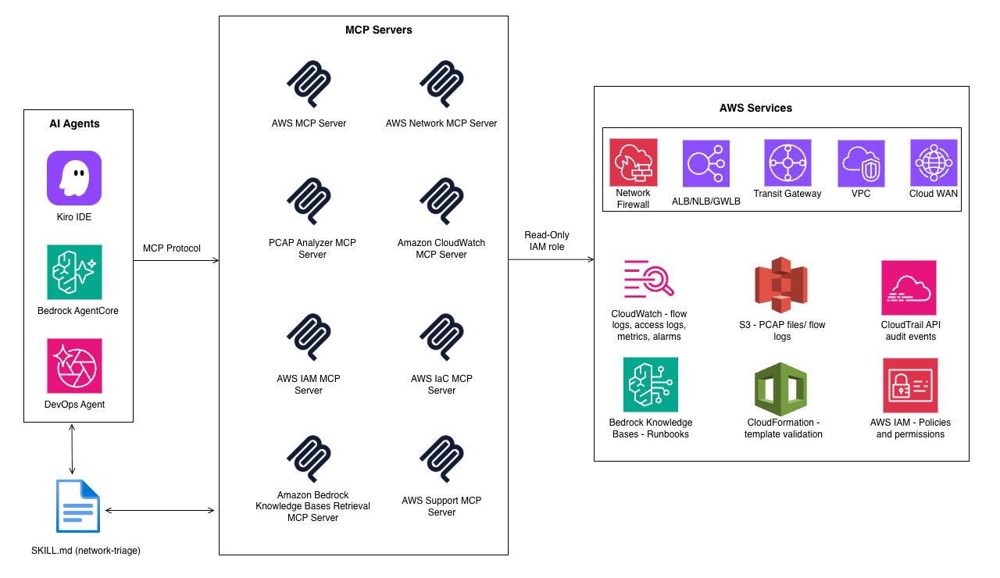

# AI Best Practices for AWS Network Operations with AI Agents and MCP

<div align="center">

[](https://github.com/aws-samples/sample-Gen-AI-best-practices-for-network-operations)
[](https://github.com/aws-samples/sample-Gen-AI-best-practices-for-network-operations)
[](https://www.python.org/downloads/)
[](LICENSE)
[](https://github.com/aws-samples/sample-Gen-AI-best-practices-for-network-operations/stargazers)

</div>

This blog post is for platform and SRE teams running 24/7 network operations and want to use AI Agents and Model Context Protocol (MCP) for intelligent, automated event response, and for individual engineers or small teams who want agentic diagnostics during development and on-call triage. If you are in the first group, focus on AWS DevOps Agent (Preview) (DevOps Agent), Amazon Bedrock AgentCore (AgentCore), and the AWS Agent Registry (Preview) Agent Registry. If you are in the second, the IDE Agents section and MCP server configuration are your starting point. Both groups share the same MCP server foundation.

> **Note:** At the time of writing, AWS DevOps Agent and the AWS Agent Registry are in Preview. Features and capabilities described in this post may change before general availability. Recommendations involving these services reflect the direction of the service; validate current capabilities against the latest documentation.

## The Network Operations Challenge

It's 2:47 AM. Traffic between your production Amazon Virtual Private Cloud (Amazon VPCs) is dropping. Amazon CloudWatch alarms are firing across three regions. Your on-call engineer is context-switching between the VPC console, flow logs, security group rules, NACLs, and AWS Cloud WAN segments and trying to mentally stitch together a network path that spans dozens of resources, accounts, and AWS services. A misconfigured AWS Transit Gateway (TGW) has been silently dropping traffic for hours. An AWS Direct Connect Border Gateway Protocol (BGP) flap looks like an application failure. A VPC Endpoint policy returns nothing more than a 403. These are typical events you encounter while operating cloud networks. Three structural barriers compound this at scale:

- **Signal-to-Noise:** Telemetry volume far exceeds any team's ability to correlate manually in real time.
- **Multi-Domain Expertise:** A single event requires simultaneous expertise across routing, firewalls, DNS, and load balancers. These skills are rarely concentrated in one person.
- **Identical Symptoms, Different Causes:** A TCP timeout could be caused by a missing TGW return route, VPN instability, a NACL missing a return rule, or an AWS Network Firewall rule. Each requires different tools and teams.

These barriers don't just slow teams down, they fundamentally limit what's possible with manual investigation. No single engineer can hold the full topology in their head, correlate telemetry across services in real time, and simultaneously reason about routing, security policy, DNS, and protocol behaviour. This is precisely where AI agents provide a structural advantage. They correlate telemetry automatically across services, bridge domain knowledge gaps by querying every relevant data source in parallel. The result is a compressed root cause identification, from hours to minutes for common fault patterns. This blog shows how to use agentic coding tools like Kiro alongside managed services like DevOps Agent, Bedrock AgentCore, and the Agent Registry to build this capability. The approach relies on structured investigation skills, scoped IAM boundaries, and human approval gates at every consequential step. We start with the building blocks, then show how they combine into real operational workflows.

## The AI NetOps Stack

Solving the multi-domain correlation problem requires more than a chatbot that answers questions from static documentation. It requires an autonomous system that queries live data sources like route tables, flow logs, AWS Identity and Access Management (IAM) policies, correlates signals across services, and takes structured actions without waiting for a human to initiate each step. Unlike a chatbot, an AI agent acts on your actual environment in real time. Building this capability requires four layers: an agent that orchestrates investigations, a set of domain-specific tools the agent can invoke, a registry that governs which tools are available, and a runtime that handles execution across multiple accounts and Regions. Figure 1 shows these layers.



                               *Figure 1: Layers of AI Network Operations*

### Agents

There are many agent options available, and this field is constantly evolving. Based on your requirements, you can choose managed solutions like DevOps Agent, self-managed custom agents using Bedrock AgentCore and supporting services like the Agent Registry and Bedrock AgentCore Gateway, or agents that run on individual workstations like Kiro and other MCP-compatible IDE agents. The sections below describe each option and when to use it. See the Agent Option Choice section for a detailed comparison table.

### MCP Servers

An agent is only as capable as the data sources it can reach. The challenge with network troubleshooting is that relevant data is scattered across routing tables, flow logs, packet captures, IAM policies, and organizational runbooks, each accessible through different APIs and requiring different expertise to interpret. MCP (Model Context Protocol) servers bridge this gap by giving agents structured, domain-specific access to each data source through a unified interface. See the Best Practices section for the recommended MCP server configuration for network operations.

### DevOps Agent

The fastest path to agentic network operations is a fully managed agent that requires no infrastructure setup. DevOps Agent is exactly this, a zero-touch agent that begins investigating the moment an alert fires, with no human initiation required. Investigations trigger automatically from Amazon Cloudwatch, Dynatrace (native 2-way integration), Datadog, Grafana, New Relic, or Splunk events via webhooks, and support tickets from ServiceNow or PagerDuty (These are some of the 3P vendors AWS DevOps Agent integrates today. For full list refer to AWS DevOps page). The agent ingests telemetry from Amazon CloudWatch, Amazon Simple Storage Service (Amazon S3), and the observability platforms listed previously, then correlates with recent deployments from GitHub and GitLab. It understands why an application broke not just that it broke.

### Custom Agent with Bedrock AgentCore

DevOps Agent covers the managed, zero-configuration path. But some organizations need full control over the agent's behavior: custom prompts, proprietary tools, specific investigation ordering, or integration with internal systems. With Bedrock AgentCore you can build your own agentic AI workloads. With AgentCore Gateway, you can convert APIs, AWS Lambda functions, and existing MCP servers into secure, managed tool endpoints. These endpoints can support transport protocols and handle authentication. Encode your diagnostic methodology as an agent skill and publish it to the Agent Registry to centrally govern which tools agents can invoke, the order of investigation steps, and the prompts that drive each action. With AgentCore Memory, your agent retains context across sessions which helps the agent pull up prior findings when a similar alert fires. AgentCore Observability captures traces, logs, and metrics for every agent session, giving full auditability of every tool call and decision.

### Agent Registry

Both DevOps Agent and custom Bedrock AgentCore agents benefit from a shared governance layer: the Agent Registry. As your agentic toolset grows with more MCP servers, skills, and agent consumers, governing what agents can discover becomes critical. You need a way to control what agents use in production. Hardcoding tool lists into prompts doesn't scale and introduces drift between what's approved and what's running. With the Agent Registry, you can publish MCP servers, agent skills, and custom resources as approved, discoverable resources. Both engineers and AI agents discover published resources through hybrid semantic search dynamically. Maintain separate production and development registries; when a curator deprecates a record, it is immediately removed from all agent discovery queries.

Think of it as the control plane for your agent environment: MCP servers, custom skills, and agent definitions can be published for central governance, Bedrock AgentCore agents discover their tools through it, and your security team approves or deprecates resources in one place. AWS DevOps Agent additionally maintains its own learned and custom skills for investigation guidance.

### IDE and Desktop Agents

The same MCP servers that power managed and custom agents also work directly on an engineer's workstation. Agents like Kiro, Kiro CLI and other MCP-compatible IDE and CLI agents all support MCP server configuration natively. Add the same JSON profile to your IDE or desktop client and these agents gain identical network diagnostic capabilities: querying flow logs, tracing routes, analyzing packet captures, and inspecting IAM policies. This makes agentic network operations accessible during development, on-call triage, and ad-hoc investigation in addition to automated production workflows.

### Agent Option Choice

This flexibility means teams don't have to choose a single agent strategy. Use DevOps Agent for automated production incident response, a custom Bedrock AgentCore agent for organization-specific workflows, and IDE agents for ad-hoc investigation during development and on-call. The MCP servers are the constant - the same tools, the same data access, governed by the read-only IAM role bound to the MCP servers regardless of which agent invokes them. The following table summarizes when to use each agent type based on your operational scenario:

| Dimension | DevOps Agent | Custom Agent (Bedrock AgentCore) | IDE Agents |
|-----------|-------------|----------------------------------|------------|
| **Best for** | Automated production incident response | Organization-specific workflows, custom toolchains | Ad-hoc troubleshooting, development-time diagnostics |
| **Trigger** | Amazon CloudWatch alarm (zero-touch) | API call, event rule, or manual invocation | Engineer types a prompt in their IDE/CLI |
| **Setup effort** | Minimal: managed service, configure integrations + Agent Space | Medium: build agent logic, deploy runtime, configure Gateway | Minimal: add MCP server JSON to IDE config |
| **Customization** | Skills + Agent Space scoping | Full control: prompts, tool ordering, memory, custom tools | Limited to prompt quality; no persistent memory across sessions |
| **Skill loading** | Automatic: matches skill description to alert context | Explicit in prompt (SKILL: network-triage) | Manual: provide methodology or reference files in context |
| **Memory / learning** | Learns from past investigations within Agent Space | AgentCore Memory persists across sessions | Stateless (per-session context only) |
| **Governance** | Agent Space boundaries, IAM roles, audit trail | Full IAM control, AgentCore Observability, Agent Registry | Individual engineer's IAM credentials; no centralized audit |
| **Ideal team size** | Platform/SRE teams running 24/7 on-call | Central platform team building for multiple consumers | Individual engineers or small teams |
| **Output destination** | ServiceNow, PagerDuty, Slack, Jira | Configurable; programmatic integration | IDE chat panel (engineer reads directly) |
| **Cost model** | Managed service pricing | Pay per token + runtime costs | Pay per token; no infrastructure cost |
| **When NOT to use** | When you need custom investigation logic or internal system integration | When setup complexity is not justified for the use case | When centralized governance and auditability are required |

## Core Use Cases

With the stack in place, the question becomes: what exactly do agents do with these tools? Network operations spans four core activities of troubleshooting, configuration analysis, change management, and operational intelligence. Each presents unique challenges that agents address differently.

### 1. Intelligent Troubleshooting with Agent Skills

The most impactful use case is incident investigation. When an alarm fires, the agent needs a structured methodology, not ad-hoc tool calls. Encode your diagnostic methodology as an agent skill in a file named SKILL.md stored in a version-controlled repository that agents load on demand. For enterprise governance, publish it to the AWS Agent Registry (Preview). Where the skill lives depends on the agent type:

- **DevOps Agent:** Create the skill in the DevOps Agent console. The skill loads automatically when an alert matches the skill description.
- **Custom Bedrock AgentCore agent:** Store SKILL.md in a Git repository or S3 bucket and reference the skill explicitly in the agent prompt (for example, SKILL: network-triage).
- **IDE agents:** Store SKILL.md in your local project repository. The agent loads it when the prompt references the skill name.

The network-triage skill shown in the following snippet is a custom example that defines ordered investigation layers with an explicit stop condition: halt at the first confirmed fault. The routing and policy tools come from the AWS Network MCP Server; the protocol analysis tools require the PCAP Analyzer MCP server.

The following is the literal content of a SKILL.md file. Copy it into your repository and adapt the investigation steps to your environment:

```yaml
---
name: network-triage
version: "1.1"
description: >
  Investigation procedures for AWS network connectivity failures
  including Transit Gateway routing issues, VPC security policy blocks,
  DNS failures, TLS/protocol faults, and IAM permission errors. Use this
  skill when investigating packet drops, TCP timeouts, VPC flow log
  REJECTs, or any connectivity failure across VPC, TGW, Cloud WAN, or
  Direct Connect.

# Network Triage

Stop at first confirmed fault. Always invoke before ad-hoc queries.

## OBSERVE (CloudWatch MCP)

- get_active_alarms, get_alarm_history: identify when the fault started.
- execute_log_insights_query on flow log groups: top-contributing subnet/ENI.

## ROUTE (Network MCP)

- find_ip_address (both IPs), get_eni_details, get_tgw_routes, get_cloudwan_routes:
  check BOTH directions. Missing return route is the leading cause.
- Evidence: ACCEPT at source, zero records at destination.

## POLICY (Network MCP + CloudTrail)

- SGs src+dst, NACLs inbound+outbound (stateless; return rules must be explicit),
  VPC Endpoint policies, Network Firewall rule groups.
- Evidence: REJECT at destination.

## DNS (Network MCP)

Prerequisite: ACCEPT both sides but application fails.

## LOAD BALANCER (Network MCP)

Prerequisite: ACCEPT both sides but application fails.

## PROTOCOL (PCAP Analyzer)

- analyze_tls_handshakes
- analyze_sni_mismatches
- analyze_tcp_retransmissions

## IDENTITY (IAM MCP)

## KNOWLEDGE (Bedrock KB)

## ESCALATE (Support MCP)

## OUTPUT

Fault layer → Evidence → CloudTrail attribution → CLI fix → Rollback

## SAFETY

Read-only. No production changes without human approval
---
```

### 2. Configuration Analysis

Configuration drift is the leading cause of network issues: a security group rule that was correct last week no longer matches the IaC baseline, or a route table was manually modified during an emergency and never reverted. Agents compare live AWS Config state against IaC baselines and attribute any delta via AWS CloudTrail to find out which IAM principal made the change, when, and how. The same capability that investigates incidents also detects drift before it causes one. For example, change in Amazon VPC via get_vpc_network_details, Cloud WAN segment action or attachment policy drift via get_cloudwan_details, pre-change route simulation via simulate_cloud_wan_route_change and TLS drift via PCAP.

### 3. Change Management

Agents that detect drift after it happens can also de-risk changes before they happen. Network changes carry real risk. A route table modification that looks correct can create an asymmetric forwarding path that only breaks under specific traffic patterns. Agents automate three steps that engineers typically rush or skip. These steps are capturing a routing baseline before the change, simulating the impact, and validating protocol behavior afterward.

**Pre-change (baseline capture and validation):**

Configure your network automation agent to perform the following steps. Examples of such agents include an agentic runbook in AWS Systems Manager or a CI/CD pipeline step triggered before cfn-lint and cfn-guard approve a AWS CloudFormation changeset.

- Snapshot current routing state using `get_all_tgw_routes` / `get_all_cloudwan_routes` and persist before/after tables to S3.
- Run `simulate_cloud_wan_route_change` against the proposed change to flag asymmetry or black-hole risks.
- Gate the change: only proceed if simulation passes. Embed a rollback command in the AWS Systems Manager automation document.

**During change (real-time monitoring):**

- The agent subscribes to `get_cloudwan_logs` and monitors topology change events and route propagation in real time. If propagation stalls or unexpected routes appear, it triggers an automatic rollback.

**Post-change (protocol-level validation):**

- CloudWatch metrics (latency, error rates, packet loss) may remain within acceptable thresholds while users report degraded performance. In this case, the agent triggers a time-bounded PCAP capture using VPC Traffic Mirroring (for example, 5 minutes of traffic on the affected ENIs) and runs `analyze_tls_handshakes` + `analyze_connection_lifecycle` + `analyze_tcp_retransmissions` on the captured sample.
- Subtle regressions, such as elevated retransmissions that remain below alarm thresholds, are visible only at the packet level. Standard CloudWatch metrics aggregate at 1-minute granularity. These metrics may not surface protocol-level issues until they cascade into application errors. If the agent detects degradation in the PCAP sample, it flags the change as degraded before the window closes.

### 4. Operational Intelligence

Troubleshooting, drift detection, and change validation all operate on individual events. Some faults only emerge from the correlation of multiple signals, none alarming on their own, but collectively pointing to a developing problem. Individual metric thresholds miss faults that only appear when signals correlate. A VPC Flow Log REJECT ratio increases combined with a Security Group AWS CloudTrail modification event from the same time window points to a policy change that broke traffic. An AWS Direct Connect VirtualInterfaceBpsEgress drop combined with a VirtualInterfaceBgpPrefixesAccepted decrease on the same virtual interface indicates a routing withdrawal. It does not indicate a link failure. Agents evaluate these multi-signal combinations continuously, surfacing fault precursors before users report impact.

## Best Practices

The use cases above demonstrate what's possible. But agent effectiveness depends entirely on the quality of their operational environment. An agent with incomplete permissions, missing flow logs, or untagged resources will produce incomplete investigations. The following best practices verify that agents have the context they need to deliver consistent results.

### MCP Servers

Use the following MCP servers as your starting configuration and evolve your environment as the landscape changes. For the latest official AWS MCP servers list, refer to this repository. The servers listed here work with supported MCP-compatible client. The following JSON is an MCP client configuration that declares which MCP servers your agent can invoke. Each entry specifies the server's package name, how to launch it (uvx for Python packages), and which AWS credentials and region to use. Save this file in the location your client reads, for example Kiro reads `.kiro/settings/mcp.json` at workspace level or `~/.kiro/settings/mcp.json` at user level.

Replace `AWS_PROFILE` with the named profile your organization uses for network read-only access. Replace `AWS_REGION` with your primary operating region.

```json
{
  "mcpServers": {
    "awslabs.aws-network-mcp-server": {
      "command": "uvx",
      "args": ["awslabs.aws-network-mcp-server@latest"],
      "env": { "AWS_PROFILE": "network-ops", "AWS_REGION": "us-east-1" }
    },
    "aws-mcp": {
      "command": "uvx",
      "timeout": 100000,
      "transport": "stdio",
      "args": [
        "mcp-proxy-for-aws@latest",
        "https://aws-mcp.us-east-1.api.aws/mcp",
        "--metadata", "AWS_REGION=us-west-2"
      ]
    },
    "pcap-analyzer-mcp-server": {
      "command": "uvx",
      "args": [
        "--from", "git+https://github.com/aws-samples/sample-pcap-analyzer-mcp",
        "awslabs.pcap-analyzer-mcp-server"
      ],
      "env": { "FASTMCP_LOG_LEVEL": "ERROR" }
    },
    "awslabs.cloudwatch-mcp-server": {
      "command": "uvx",
      "args": ["awslabs.cloudwatch-mcp-server@latest"],
      "env": { "AWS_PROFILE": "network-ops", "FASTMCP_LOG_LEVEL": "ERROR" }
    },
    "awslabs.iam-mcp-server": {
      "command": "uvx",
      "args": ["awslabs.iam-mcp-server@latest"],
      "env": { "AWS_PROFILE": "network-ops", "AWS_REGION": "us-east-1", "FASTMCP_LOG_LEVEL": "ERROR" }
    },
    "awslabs.bedrock-kb-retrieval-mcp-server": {
      "command": "uvx",
      "args": ["awslabs.bedrock-kb-retrieval-mcp-server@latest"],
      "env": { "AWS_PROFILE": "network-ops", "AWS_REGION": "us-east-1", "FASTMCP_LOG_LEVEL": "ERROR" }
    },
    "awslabs.aws-iac-mcp-server": {
      "command": "uvx",
      "args": ["awslabs.aws-iac-mcp-server@latest"],
      "env": { "AWS_PROFILE": "network-ops", "FASTMCP_LOG_LEVEL": "ERROR" }
    },
    "awslabs.aws-support-mcp-server": {
      "command": "uvx",
      "args": ["awslabs.aws-support-mcp-server@latest"],
      "env": { "AWS_PROFILE": "network-ops" }
    }
  }
}
```

#### MCP Server Roles

| MCP Server | NetOps Role |
|------------|-------------|
| **AWS MCP Server (agent-toolkit-for-aws)** | Gives AI agents and coding assistants secure, authenticated access to supported AWS services through a small, fixed set of tools |
| **AWS Network MCP Server** | Amazon VPC / AWS Transit Gateway / AWS Cloud WAN path tracing, flow log queries, route analysis, AWS Network Firewall rule inspection |
| **PCAP Analyzer MCP Server** | Protocol-layer forensics: TLS handshakes, TCP retransmissions, SNI mismatches, cipher suite analysis |
| **Amazon CloudWatch MCP Server** | Active alarm analysis, alarm history, metric data retrieval pinpoints when and where before network investigation begins |
| **AWS IAM MCP Server** | Role and policy inspection, permission simulation surfaces identity failures that present as network errors |
| **Amazon Bedrock Knowledge Bases Retrieval MCP Server** | Runbooks, ADRs, post-incident reports grounds findings in your organization's actual architecture intent |
| **AWS IaC MCP Server** | AWS CloudFormation template validation (cfn-lint), compliance checks (cfn-guard) validates fixes before deployment |
| **AWS Support MCP Server** | Creates AWS Support cases with full diagnostic context when service-plane faults are suspected |

### Data Foundation Tiers

Agents reason over data. If critical signals are missing, the agent's investigation will be incomplete regardless of how good the methodology is. Verify that your data foundation covers all three tiers:

| Tier | Sources |
|------|---------|
| **Structured** | Amazon VPC / AWS Transit Gateway Flow Logs, Amazon CloudWatch Logs, AWS Config, AWS CloudTrail, AWS Network Firewall alert and flow logs, Amazon Route 53 Resolver DNS Firewall logs |
| **Semi-structured (Packet)** | VPC Traffic Mirroring sent to an ENI, NLB, or Gateway Load Balancer endpoint target, with the receiving appliance writing PCAPs to Amazon S3 (SSE-KMS encrypted) |
| **Unstructured** | Amazon Bedrock Knowledge Bases using Runbooks, Architecture Decision Records |

### Cost Considerations

The data foundation described in this section creates ongoing charges that scale with your environment size. The following table summarizes the cost drivers and links to current pricing. Plan your rollout incrementally. Begin in one account or region, validate the cost profile, and broaden scope incrementally.

Traffic Mirroring in particular scales with mirrored volume. Treat it as a diagnostic tool: mirror specific ENIs for a bounded duration (minutes, not hours) in response to a specific investigation trigger, then disable. It is not designed for continuous monitoring.

| Service | Cost Driver | Guidance |
|---------|-------------|----------|
| **AWS Config** | Per configuration item recorded; per rule evaluation | Scope recording to network resource types only. Disable types the agent does not query. |
| **VPC Flow Logs** | Per GB ingested (CloudWatch Logs) or stored (S3) | Use S3 destination for cost efficiency. Filter to REJECT-only if full logs are not needed. |
| **AWS CloudTrail** | First management trail per region is free; data events and additional trails incur per-event charges | One organization trail with management events is sufficient for this use case. |
| **VPC Traffic Mirroring** | Per ENI-hour mirrored + standard data transfer | Use targeted, time-bounded sessions only. Do not run continuously. Turn it on only during change validation windows or active troubleshooting. |

### Structure Your Agent Spaces Intentionally

Think about Agent Space boundaries the same way you think about on-call responsibilities:

- Grant access to accounts relevant to the application.
- Separate production from non-production environments.
- If applications are tightly coupled (e.g. microservices that depend on each other), use a single Agent Space per resolver group.
- An Agent Space that's too narrow misses critical cross-account context; one that's too broad introduces noise.

### Verify IAM Permissions Are Complete but Scoped

Deploy the full recommended IAM policy from day one. The AWS Network MCP Server requires specific read-only permissions (`ec2:Describe*`, `networkmanager:Get*`, `network-firewall:Describe*`, `logs:StartQuery`, etc.). Missing a single permission like `logs:GetQueryResults` silently breaks flow log analysis.

### Tag Your Resources Consistently

Agents use tags to understand resource purpose and ownership. An AWS Transit Gateway attachment tagged `Environment=Production`, `Service=PaymentAPI` gives the agent dramatically more context than an untagged `tgw-attach-0abc123`.

### Comprehensive Recording for Agent Visibility

Turn on organization-level AWS Config recording for network resource types and AWS CloudTrail management events in production accounts and regions where your agents investigate. For non-production environments, turn on AWS Config recording selectively or on-demand across all account. Scope Config recording to the resource types your agents investigate (for example, `AWS::EC2::SecurityGroup`, `AWS::EC2::VPC`, `AWS::EC2::TransitGateway`) to control cost.

### Write Effective Prompts

Even with the right tools and permissions, an agent's output quality depends heavily on how you frame the task. Vague prompts force the agent to pull everything and waste tokens on irrelevant paths. Precise prompts with bounded time windows, specific endpoints, and explicit skip-lists produce dramatically faster and more accurate results. The following example shows how to refine a vague prompt into a structured investigation request. This is not a required format; adapt the structure to your environment and incident context.

**Vague prompt (agent pulls everything and burns tokens):**

```
"Why is my network slow?"
```

**Structured prompt (scoped, actionable, token-efficient):**

```
SKILL: network-triage
GOAL: TCP timeout from ECS "order-api" (vpc-0a1b2c3d, 10.2.0.0/16) to Aurora "prod-db"
      at 10.5.1.47:5432 (vpc-9e8f7g6h, 10.5.0.0/16) via pcx-0abc123.
      Worked until 14:30Z today. Account 111222333444, us-east-1.
RETRIEVE: Route tables, SGs, NACLs. Flow Logs + CloudTrail ec2:*Route* 13:30-15:30Z.
If ACCEPT both sides but app fails -> analyze s3:// amzn-s3-demo-captures/pcap/2026-04-17/capture.pcap
SKIP: DNS reachable / ECS healthy / RDS available / Credentials valid
SAFETY: Read-only. Capture pre-change state before proposing any fix.
```

## Security, Governance, and Human-in-the-Loop

Giving agents the right data is necessary but not sufficient. You also need guardrails to verify that agents remain powerful diagnostic tools without becoming unaudited actors in your environment. Agent access to production infrastructure requires the same security rigor as any other automation, because agents make decisions autonomously.

- **IAM separation:** Diagnostic agents must be strictly read-only. Remediation agents assume a separate role only after human approval, with tag conditions blocking writes to any resource tagged `Environment: production`.
- **Auditability:** Use AWS STS AssumeRole with RoleSessionName set to the incident ticket ID. Every API call links unambiguously to a specific incident in AWS CloudTrail.
- **Change gates:** Apply three gates before any agent-proposed change: syntactic (does the resource exist?), semantic (does this create a routing loop?), and impact (is it reversible in a single API call?).
- **PCAP security:** Encrypt all Amazon S3 captures with SSE-KMS. When the PCAP Analyzer MCP Server is deployed locally via stdio, packet content stays within your environment. If deployed as a remote server, verify that the transport is encrypted and scoped to your VPC.
- **Output controls:** Configure Amazon Bedrock Guardrails to redact IP addresses (built-in PII filter) and account IDs (custom regex filter via RegexesConfig) from outputs shared outside the investigation context.

Read-only investigation and pre-change simulations can run autonomously. Agents perform these faster and more systematically than any human. Route change simulations are autonomous; the engineer approves or rejects the proposed change before anything touches production. Security Group or AWS Network Firewall rule modifications require the agent to recommend the change and prepare a rollback command, with the engineer executing and verifying the outcome.

Changes to production AWS Transit Gateway routes or AWS Direct Connect VIFs are the sensitive: the agent presents evidence and waits for explicit human approval before any action is taken.

This graduated autonomy model from fully autonomous read-only operations to human-gated production changes gives teams confidence to deploy agents broadly while maintaining control over consequential actions.

## End-to-End Incident Walkthrough

With the stack, use cases, best practices, and governance model established, following is everything working together in a single end-to-end incident. This walkthrough is a constructed scenario based on common mTLS rotation failures observed in production environments. The numbers (alert counts, percentages, resolution times) are illustrative. The investigation logic and tool invocations reflect how the agent operates in practice.

**Incident:** checkout-api (us-east-1, HTTP 503, ~40% of requests, since 14:22Z. No recent deployment.

The following is the agent's investigation trace, not a script to execute. Each bracketed section shows which MCP server the agent invoked and what it found.

**[Skill loads]**
network-triage v1.1 loads automatically (AWS DevOps Agent) / SKILL: network-triage (custom agent).

**[Observe: Amazon CloudWatch MCP]**
Alarm: 14:22:07Z Flow log Insights: 94% of REJECTs → 10.5.1.0/24

**[Route + Policy: AWS Network MCP]**
SGs, NACLs, TGW routes, ALB targets → all CLEAR Flow logs: ACCEPT both sides → skill advances to Protocol

**[Knowledge: Amazon Bedrock Knowledge Bases MCP]**
"payment-processor rotates mTLS certs every 90 days. Last rotation: 2026-04-17 14:15Z." Rotation 7 minutes before alarm → hypothesis: mTLS distribution failure

**[Protocol: PCAP Analyzer MCP]**
340 certificate_unknown (TLS alert code 46) SERVER→CLIENT 40% of connections RST immediately Pre-rotation cert rejected; new cert never distributed to checkout-api fleet

**[Identity: AWS IAM MCP]**
CertRotatorPolicy: ssm:PutParameter on /payment-processor/* GRANTED ssm:PutParameter on /checkout-api/* NOT GRANTED

**ROOT CAUSE CONFIRMED.** Skill stops here.

**[Fix validation: AWS IaC MCP]**
cfn-lint: no syntax errors cfn-guard: no compliance violations Reversible: yes

**[Human approves]**
IAM policy updated → Lambda re-runs → 503 rate: 0 in 90 seconds

## Measuring Success

Establish a baseline before deploying agents. Measuring impact requires a starting point. Track three metrics:

| Metric | Baseline (Manual) | Target (With Agents) | How to Measure |
|--------|-------------------|---------------------|----------------|
| **Mean Time to Resolution (MTTR)** | For example: 45-90 minutes | For example: Sub-10 minutes for common patterns | Elapsed time from alert firing to confirmed resolution in ticketing system |
| **Investigation Accuracy** | Varies by engineer expertise | Consistent across common fault patterns | Track root cause correctness, false positive rate, and context completeness weekly |
| **Operational Efficiency** | Baseline headcount per incident | Reduction in after-hours pages; more investigations per engineer per week | Calculate: (time saved per investigation × investigation volume per month) minus (agent runtime + token cost). Track weekly to establish your break-even point. |

As event volume grows and agents handle dozens of investigations daily, manual review of every output becomes impractical. Instead, use LLM-as-a-Judge: after each investigation completes, send the full transcript to a second Amazon Bedrock model. The transcript includes the original alert, tool calls, intermediate reasoning, and final root cause hypothesis. The model uses a structured evaluation prompt to score the investigation. The evaluator scores each investigation on root cause correctness, evidence completeness, reasoning coherence, and methodology adherence.

Three patterns make this effective:

1. **Pairwise comparison** by presenting the agent's root cause alongside the engineer-confirmed root cause; the evaluator judges semantic match, even when worded differently.
2. **Rubric-graded evaluation** by defining a 1–5 scale for each quality dimension independently, and weight methodology adherence highest.
3. **Continuous calibration** by periodically comparing LLM-as-a-Judge scores against human expert scores on the same investigations; below 85% agreement, refine the evaluation prompt or switch evaluator models.

A declining score on evidence completeness almost always indicates a data foundation gap, for example a new Amazon VPC without flow logs turned on, or an AWS Transit Gateway not yet registered with AWS Network Manager. Fix the data gap and investigation quality recovers automatically.

## Getting Started Incrementally

You don't need to deploy the full stack on day one. Follow these steps in order:

1. Turn on VPC Flow Logs to Amazon CloudWatch Logs in production accounts and regions where your agents investigate. For non-production environments, turn on VPC Flow Logs selectively or on-demand. Use S3 as the destination for cost efficiency where Log Insights queries are not required. See VPC Flow Logs pricing for ingestion and storage costs at your expected volume.
2. Register your AWS Transit Gateways with AWS Network Manager.
3. Tag your resources consistently (Environment, Service, Owner).
4. Provision the recommended IAM policy for the AWS Network MCP Server.
5. Create SKILL.md in the DevOps Agent Web App and assign it to an Agent Space.
6. Connect the AWS Network MCP Server and run it on your next incident.
7. Measure MTTR before and after. Use the results to make the case for the full stack.

## Common Pitfalls

Even with the right architecture and measurement in place, teams consistently encounter the same operational mistakes when deploying agents. These pitfalls are avoidable, but only if you know to look for them.

| Pitfall | Fix |
|---------|-----|
| Flow logs routed to Amazon S3 instead of Amazon CloudWatch Logs | Route to Amazon CloudWatch Logs, all Network MCP flow log tools require Logs Insights. |
| AWS Transit Gateway not registered with AWS Network Manager | The MCP tools `get_tgw_routes` and `get_all_tgw_routes` use the AWS Network Manager API, not the EC2 SearchTransitGatewayRoutes API. Without registration, these tools return empty with no error. Registering an AWS Transit Gateway unlocks multi-account topology visibility, route table associations, and attachment details via the AWS Network Manager API. |
| Missing `logs:GetQueryResults` permission | Silently breaks all flow log analysis. Provision the full IAM policy on day one. |
| Treating flow logs as sufficient for all faults | ACCEPT both sides but app fails = protocol-layer fault. Always escalate to PCAP analysis. |
| Agent Spaces too broad | Mixing prod and non-prod reduces precision. Use one Agent Space per resolver group. |
| Skipping the skill | Ad-hoc tool calls produce inconsistent results. For DevOps Agent, verify that the skill is assigned to the Agent Space. For custom agents, always invoke network-triage-skill explicitly. |
| Overreliance on the agent | The agent is a copilot, not an autopilot. Remediation actions require human review. |

## Conclusion

Network operations at scale requires correlating signals across routing, security policy, DNS, protocol behavior, and identity in real time. No single engineer holds that full picture; AI agents do. DevOps Agent receives Amazon CloudWatch alerts and begins correlating metrics, flow logs, and API change history before your on-call engineer has opened a terminal. The AWS Network MCP Server and companion servers provide read-only access across every network domain. The Agent Registry verifies that only approved, versioned tools run in production. With Bedrock AgentCore, you can manage execution, memory, and observability across multi-account, multi-region environments. The result: shorter investigations with confirmed root causes, validated fixes, and a human in the approval seat.

Agentic AI doesn't replace operational discipline, it amplifies it. Teams that tag resources, turn on flow logs, and maintain runbooks will see the most dramatic improvements. The tools exist today; the incremental path outlined above lets you start small, measure impact, and expand coverage as confidence grows. To get started, sign up for the AWS DevOps Agent (Preview), configure your first MCP server with the JSON profile above, and follow the Getting Started Incrementally steps in this post.
